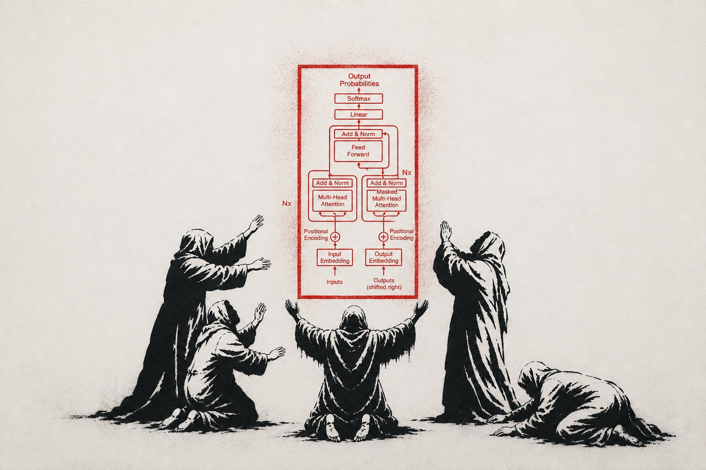

*This project has been created as part of the 42 curriculum by fdinis-d.*

<p align="center">
  
</p>

# call_me_maybe

## Description

`call_me_maybe` is an introduction to **function calling in LLMs** through **constrained decoding**.

Given a natural language prompt (e.g. *"What is the sum of 2 and 3?"*) and a catalog of function definitions, the program produces a JSON object describing which function to invoke and with what arguments:

```json
{
  "prompt": "What is the sum of 2 and 3?",
  "name": "fn_add_numbers",
  "parameters": { "a": 2.0, "b": 3.0 }
}
```

The output is **guaranteed to be valid JSON** matching one of the provided function signatures — not because we ask the model nicely, but because the decoding loop only allows the model to pick tokens that keep the output structurally valid.

The underlying model is **Qwen3-0.6B**, accessed through a minimal SDK (`llm_sdk`) that exposes `get_logits_from_input_ids`, `encode`, and `decode`. No high-level frameworks (transformers, outlines, dspy, etc.) are used.

## Instructions

Requirements: `uv` (Python package manager) and Python 3.12+.

```sh
make install            # uv sync — install dependencies
make run                # run on data/input/function_calling_tests.json
make run-large          # run with the larger Qwen3-1.7B model
make run-verbose        # run, printing the token-by-token generation trace
make run-large-verbose  # larger model + trace
make run-compare        # show unconstrained vs constrained output side by side
make lint               # flake8 + mypy
make clean              # remove caches
```

By default the program reads:
- prompts from `data/input/function_calling_tests.json`
- function definitions from `data/input/functions_definition.json`

and writes results to `data/output/function_calling_results.json`.

You can override any of those with CLI flags:

```sh
uv run python -m src \
  --input data/input/function_calling_tests.json \
  --functions_definition data/input/functions_definition.json \
  --output data/output/function_calling_results.json
```

## Bonus Features

All of the following are implemented and runnable:

- **`--model <hf_repo_id>`** — run any Hugging Face causal-LM with a
  `vocab.json` tokenizer instead of the default `Qwen/Qwen3-0.6B` (e.g.
  `--model Qwen/Qwen3-1.7B`). Nothing in the decoder is model-specific; it
  works through the SDK interface, so swapping the model is one flag.
- **`--verbose`** — visualizes the generation process on `stderr`: for each
  prompt it prints every picked token, the running name prefix, and the FSM
  state, so you can watch the constraint narrow the choices step by step.
- **`--compare`** — for each prompt, runs the same parameter prompt **without**
  the constraint mask (plain greedy decoding, `src/baseline.py`) and prints it
  next to the constrained output. The unconstrained model typically emits
  malformed JSON, markdown fences, or runaway repetition — a direct
  demonstration of what the constrained decoder prevents.

## Resources

References I actually used while building this:

- **Andrej Karpathy — Let's build the GPT Tokenizer**: https://www.youtube.com/watch?v=zduSFxRajkE (background on tokens and vocabularies)
- **3Brown1Blue playlist** (Neural networks): https://youtube.com/playlist?list=PLZHQObOWTQDNU6R1_67000Dx_ZCJB-3pi
- **The Tokenizer Playground (Xenova)** — interactive tokenizer visualizer: https://huggingface.co/spaces/Xenova/the-tokenizer-playground
- **Attention Is All You Need** (Vaswani et al., 2017): https://research.google/pubs/attention-is-all-you-need/
- **Hugging Face — small text-generation models** (≤6B, transformers): https://huggingface.co/models?pipeline_tag=text-generation&num_parameters=min:0,max:6B&library=transformers&apps=ollama&sort=trending

### Use of AI

AI (Claude) was used as a pair-programming assistant — explaining concepts (logits, tokens, state machines, constrained decoding), reviewing my code for bugs, and suggesting refactors. All design decisions, structure, and the final code in this repository were chosen and written by me; AI helped me reason about the problem and catch mistakes, not write the project for me.

## Algorithm Explanation

The core idea of **constrained decoding** is to modify the model's logits *before* sampling the next token. For every step, we compute the set of tokens that are *valid given the current state of the output*, then set the logits of all other tokens to `-inf`. The argmax then necessarily picks a valid token.

This project uses a **two-step pipeline**:

### Step 1 — Function name selection (`select_function`)

We want the model to emit one of the function names verbatim. A simple loop:

1. Start with `current_prefix = ""`.
2. Get logits from the model.
3. Compute the set of `valid_token_ids`: every token `t` such that `current_prefix + t` is a **prefix of**, or **extends** to a prefix of, one of the function names. This is effectively a trie walk over the function-name set.
4. Mask invalid logits to `-inf`, take the argmax, append the token to `current_prefix`.
5. Stop when `current_prefix` exactly matches one of the function names → return the corresponding `FunctionDefinition`.

### Step 2 — Parameter extraction (`extract_parameters`)

Once the function is known, we generate its parameters as JSON. This is driven by a **finite state machine** with these states:

```
START → KEY_OPEN → KEY_CONTENT → KEY_CLOSE → COLON →
        VALUE_NUMBER ──────────────────────────┐
        VALUE_STRING_OPEN → VALUE_STRING ───────┴→ COMMA_OR_END → (KEY_OPEN | END)
```

For each state, we know exactly which tokens are allowed:

| State           | Valid tokens                                                              |
|-----------------|---------------------------------------------------------------------------|
| `START`         | `{`                                                                       |
| `KEY_OPEN`      | `"`                                                                       |
| `KEY_CONTENT`   | tokens that extend `current_key` toward the next expected parameter name  |
| `KEY_CLOSE`     | `"`                                                                       |
| `COLON`         | `:`                                                                       |
| `VALUE_NUMBER`  | digits, `.`, `-`, `,`, `}`                                                |
| `VALUE_STRING_OPEN` | `"` (the opening quote of a string value)                              |
| `VALUE_STRING`  | every token **except** `"` (the closing quote is detected via partial-token match) |
| `COMMA_OR_END`  | `,` if more parameters remain, else `}`                                   |

A strict invariant in the loop is:

> **The top half of the loop computes valid tokens for the current state. The bottom half updates the state — never the top.**

This separation is what makes the state machine work: changing the state before sampling would mean the picked token belongs to a different state than the one we just masked for. The first version of the code mixed those concerns and went into infinite loops; the fix was to draw a strict line between *masking* and *state transition*.

Once the loop emits `}`, the parameters dictionary is returned and combined with the function name into a `FunctionCall`.

## Design Decisions

- **Two-step generation (name → parameters)** over one-shot JSON. With one shot, the model would have to predict the full schema and we'd need a more complex grammar that also tracks the chosen function. Splitting it lets us reuse a simple per-step prompt and keeps the constraints minimal.
- **Argmax (greedy) decoding**, not sampling. Function calling is a structured task where we want determinism and reproducibility; temperature would only introduce noise.
- **Pydantic** for I/O validation. The subject requires data classes; pydantic gives both validation and ergonomic dataclass-like syntax.
- **State machine with explicit constants** (`START`, `KEY_OPEN`, …) instead of a regex/grammar engine. Easier to debug, no extra dependency, and directly mirrors the JSON shape we expect.
- **Precompute token sets once** at the top of `extract_parameters` (numeric tokens, quote tokens, etc.). The vocab is ~150k entries; recomputing on every step would dominate runtime.
- **Inside `VALUE_STRING`, every non-quote token is allowed**, and the closing `"` is detected even when it appears inside a multi-character token (e.g. `er"` ends a string and starts the next field). This lets the model produce arbitrary string content (including regex patterns) without us having to whitelist character ranges.
- **`model.decode(value_token_ids)`** for reconstructing string values, not concatenating raw token strings. Token strings can contain encoded byte prefixes (BPE artifacts like `Ġ`); `decode` gives the human-readable form.
- **CLI flags with defaults** in `__main__.py`: works out of the box with `make run` but is fully scriptable.

## Performance Analysis

Measured on the 11 prompts in `data/input/function_calling_tests.json`:

- **Accuracy**: 11/11 prompts produce the correct function name and parameters, including the multi-parameter regex cases (`fn_substitute_string_with_regex`).
- **Speed**: dominated by `get_logits_from_input_ids`. Each parameter token requires one forward pass; prompts with long string values (e.g. the regex prompts) take noticeably longer than the numeric ones. Total wall-clock for the 11 prompts on an M4 MacBook Air (24GB RAM) is on the order of a few minutes.
- **Reliability**: because invalid tokens are masked, the output **cannot** be malformed JSON — there's no parser to fail. The only failure mode is "the model never produces the expected structure within `MAX_TOKENS` tokens", which raises a `ValueError` and is reported as a warning without aborting the rest of the run.

Bottlenecks observed: computing `valid_tokens` for `KEY_CONTENT` iterates the full vocab on every step. For the test set this is fine, but precomputing per-key prefix sets would be the natural next optimization.

## Challenges Faced

1. **State transition timing.** The first version of `extract_parameters` updated `state` *before* sampling the next token. The masking for state N would run, but by the time the accumulator ran it was already in state N+1, so the sampled token was attributed to the wrong state. Symptom: `current_key` ended up being `"<param_name>` (with the opening quote glued in), the key never matched, and the loop ran to `MAX_TOKENS`. **Fix:** establish the invariant *all state transitions happen in the bottom half of the loop, after the token is picked*.
2. **`string_tokens` mask.** Initially defined as `vocab.id_to_token.keys() - colon_tokens`, which excluded `:` from string contents but *included* `"`. The model could then emit a `"` mid-string and the loop's quote detection fired immediately, truncating the value. **Fix:** subtract `quote_tokens` instead, and rely on the quote-inside-multichar-token check to close the string.
3. **Initial state.** The state was initialized to `KEY_CONTENT` instead of `START`, meaning the opening `{` was never emitted and the output JSON was malformed. **Fix:** initialize to `START`.
4. **Imports.** Mixing relative and absolute imports inside `src/` while launching via `python -m src` broke module resolution. **Fix:** use absolute imports (`from src.x import y`) consistently.
5. **`Small_LLM_Model` vs `Small_LLM_Model()`.** Forgetting the parentheses passed the class object into helpers expecting an instance. **Fix:** instantiate once in `main` and pass the instance.
6. **`flake8` recursion into `.venv`.** flake8 was scanning the entire virtualenv and hitting deep `sympy` files. **Fix:** dedicated `.flake8` excluding `.venv` and `llm_sdk`.

## Testing Strategy

- **Functional test set** (`data/input/function_calling_tests.json`): 11 prompts covering each function in the catalog, with both simple and harder variants (multi-digit numbers, multi-parameter regex substitutions, embedded punctuation in strings).
- **Manual inspection of `data/output/function_calling_results.json`** after each meaningful change to `constraints.py` — comparing against the expected function name and arguments for every prompt.
- **`make lint`** runs both `flake8` (style) and `mypy` (types) in strict mode (`--disallow-untyped-defs`, `--warn-return-any`, `--check-untyped-defs`).
- **Iterative debugging** during development: when an extraction failed, the failing prompt was isolated and the loop was traced step by step to identify whether the bug was in the mask or in the state transition.

## Example Usage

```sh
$ make run
uv run python -m src
Loading weights: 100%|██████████| 311/311 [00:01<00:00, 214.74it/s]
$ cat data/output/function_calling_results.json
[
  {
    "prompt": "What is the sum of 2 and 3?",
    "name": "fn_add_numbers",
    "parameters": { "a": 2.0, "b": 3.0 }
  },
  {
    "prompt": "Greet shrek",
    "name": "fn_greet",
    "parameters": { "name": "shrek" }
  },
  {
    "prompt": "Reverse the string 'hello'",
    "name": "fn_reverse_string",
    "parameters": { "s": "hello" }
  },
  {
    "prompt": "What is the square root of 16?",
    "name": "fn_get_square_root",
    "parameters": { "a": 16.0 }
  },
  {
    "prompt": "Replace all numbers in \"Hello 34 I'm 233 years old\" with NUMBERS",
    "name": "fn_substitute_string_with_regex",
    "parameters": {
      "source_string": "Hello 34 I'm 233 years old",
      "regex": "34|233",
      "replacement": "NUMBERS"
    }
  }
]
```

Running with a custom test file:

```sh
uv run python -m src --input my_prompts.json --output my_results.json
```
